# Library
#### Integrantes: David Sarria y Santiago Amador

### Cobertura

Insertamos Jacoco a el Pom
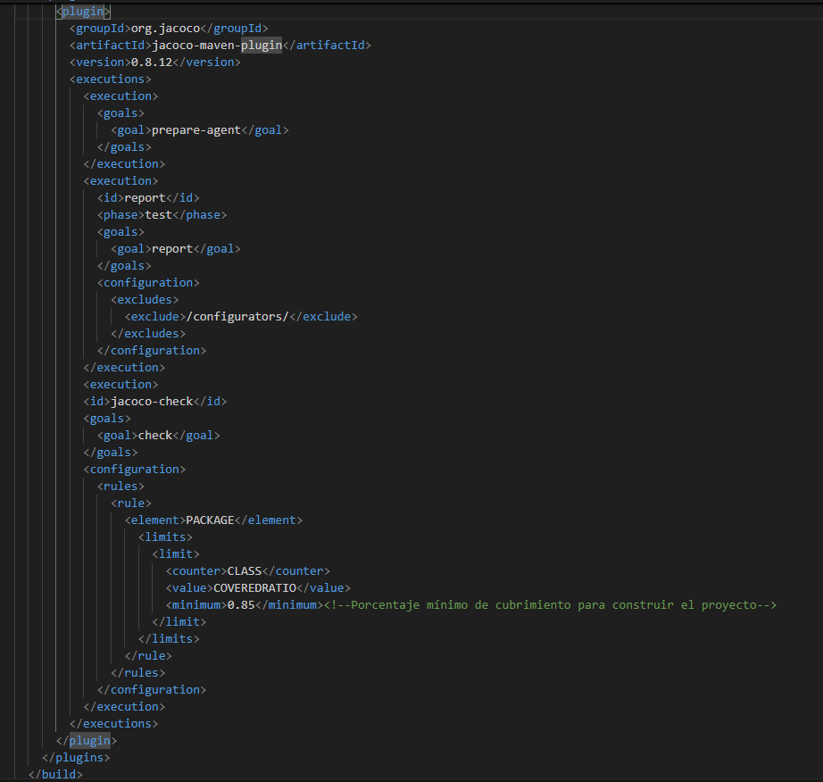

Y ejecutamos  

Ahora abrimos el index.html ubicado en target/site  
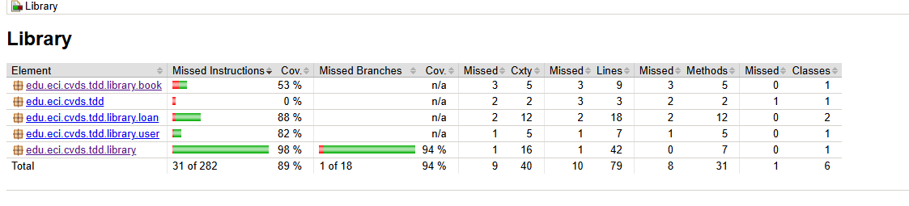  

Descargando Docker

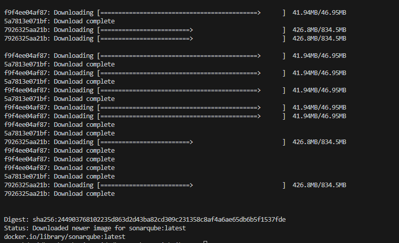     

Arrancando el servicio de SonarQube   

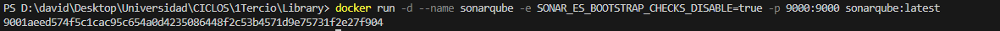     

Validamos el funcionamiento de SonarQube  
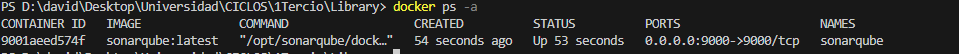  

iniciamos sesion en SonarQube  
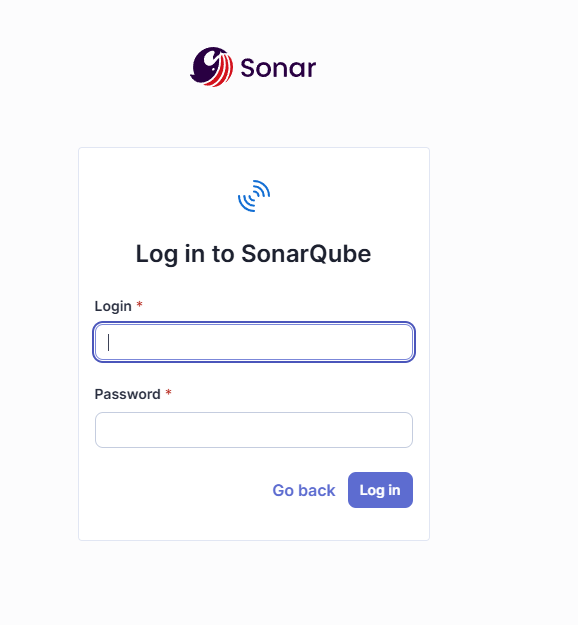  
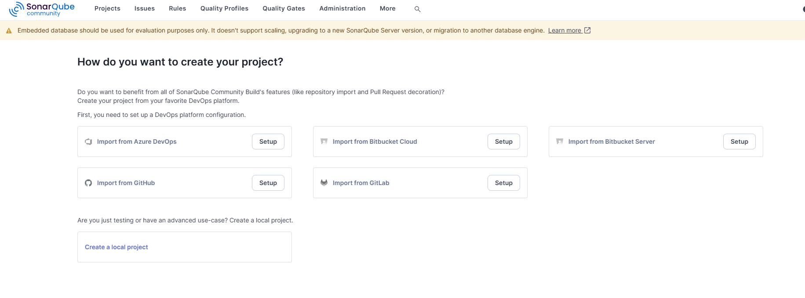    

Generamos el token   
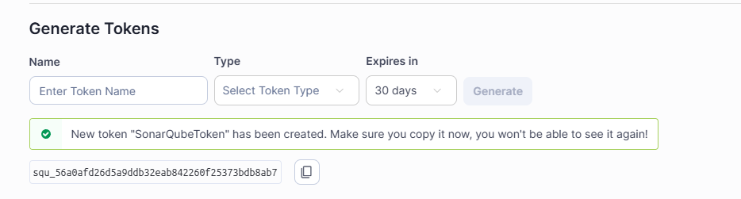   

Agregamos Sonar y las propiedades a el Pom  
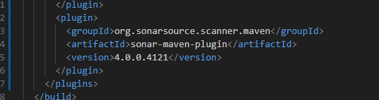
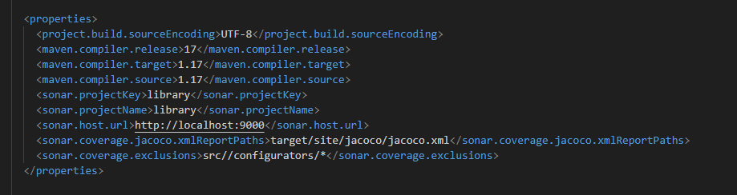  

Resolvemos conflictos para que el proyecto se consruya correctamente y ejecutamos **mvn verify sonar:sonar -D sonar.token=[TOKEN_GENERADO]**  

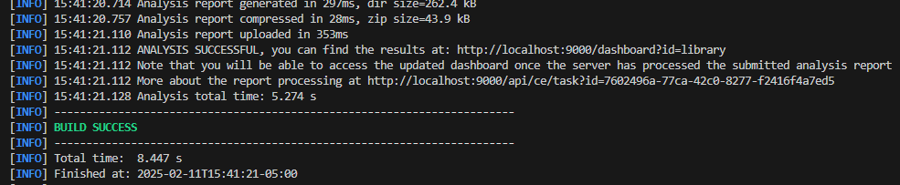   

Finalmente en la pagina de Sonar podemos ver como se esta ejecutando  

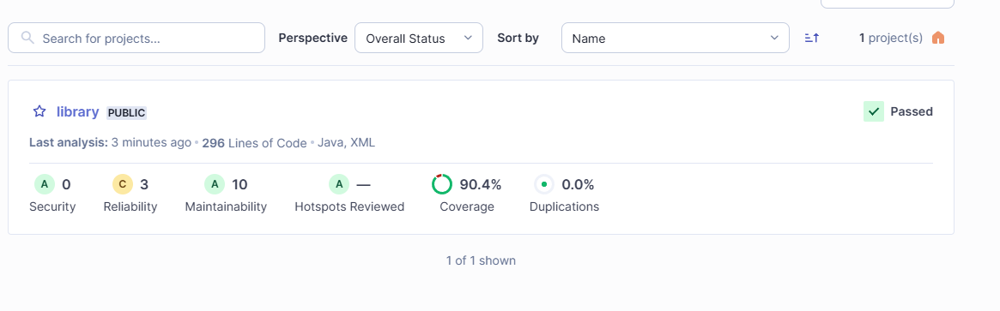   

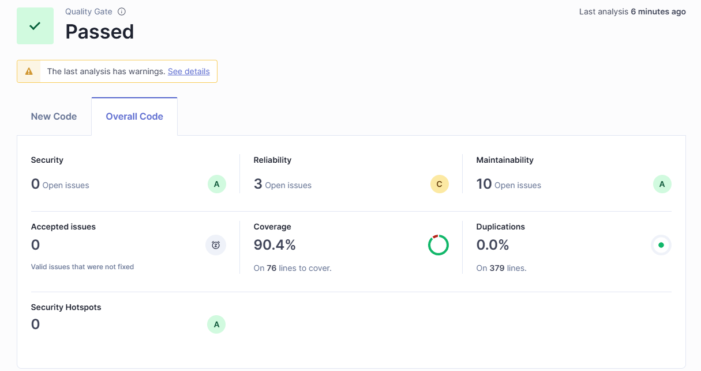 
