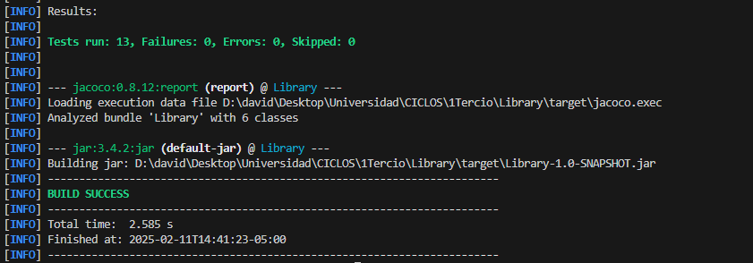

# Library-Laboratorio 3-TDD
## Integrantes: David Sarria y Santiago Amador

###     Añadiendo esqueleto y clases

- Gracias a Maven podemos crear el esqueleto del proyecto y manualmente añadimos las clases para un resultado así:

- Como se puede ver también se añadió la clase de pruebas, con el código dado en el laboratorio 
    se leyó la documentación de cada método y se realizaron 12 pruebas y procedimos a programar 
    los métodos finalmente, las pruebas realizadas fueron:

    - testShouldAddNewBook
    - testShouldAddExistingBook
    - testShouldChangeLoanStatusToReturned
    - testShouldSetReturnDateToNow
    - testShouldAddUpTheReturnedBook
    - testShouldNotReturnLoan
    - testCannotReturnAnAlreadyReturnedLoan
    - testLoanACorrectBookTest
    - testLoanABookTest
    - testNoLoanWithoutNoUserTest
    - testNoLoanWithoutBookTest
    - testNoLoanWithNoValidBookTest

- Relacionado con el proceso de TDD todo fue como es esperado y nos ayudó a ver errores en el código
    que no habíamos tenido en cuenta a la hora de escribir la implementación de los métodos, además 
    nos tocó cambiar solo cómo una prueba estaba escrita debido a confusión de como funcionaba el tipo
    de dato LocalDateTime (testShouldSetReturnDateToNow), una vez corregida hicimos package y:

- Como se puede ver dentro del cuadro rojo las 12 pruebas se corrieron sin ningún error o fallo, por lo tanto, procedemos con la parte de "Cobertura".
  
### Cobertura

Insertamos Jacoco a el Pom

Y ejecutamos  

Ahora abrimos el index.html ubicado en target/site  
  

Descargando Docker

     

Arrancando el servicio de SonarQube   

     

Validamos el funcionamiento de SonarQube  
  

Iniciamos sesión en SonarQube  
  
    

Generamos el token   
   

Agregamos Sonar y las propiedades a el Pom  

  

Resolvemos conflictos para que el proyecto se construya correctamente y ejecutamos **mvn verify sonar:sonar -D sonar.token=[TOKEN_GENERADO]**  

   

Finalmente en la página de Sonar podemos ver como se está ejecutando  

   

 
